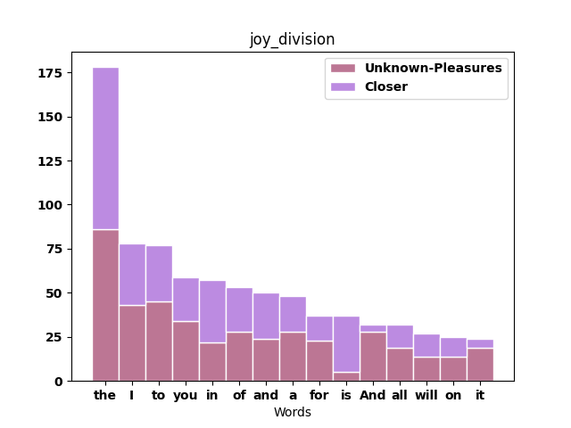
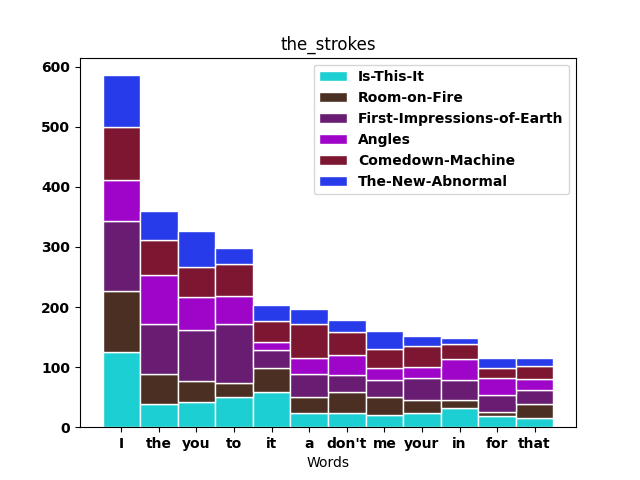
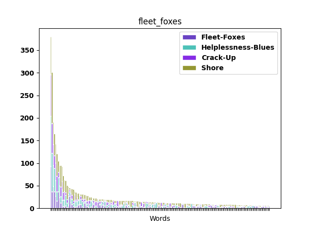

# SongWordFreq
Chart the fequency of words used by a given artist

Quick project to practice webscrapping 

**Example output:**

Top 15 words for Joy Division

Top 12 words for The Strokes

Top 200 words for Fleet Foxes

